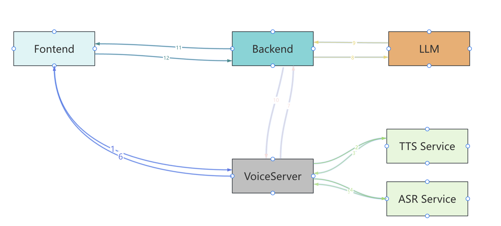

# LingEcho - Intelligent Voice Interaction Platform

<div align="center">
<div align="center">
  
</div>

**Intelligent Voice Interaction Platform - Giving AI a Real Voice**

[](https://golang.org/)
[](https://reactjs.org/)
[](https://www.typescriptlang.org/)
[](LICENSE)
[]()
[](https://lingecho.com)

[English](README.md) | [中文](README_CN.md)

### 🌐 Live Demo

**Experience LingEcho online**: [https://lingecho.com](https://lingecho.com)

</div>

---

## 📖 Project Overview

LingEcho is an enterprise-grade intelligent voice interaction platform based on Go + React, providing a complete AI voice interaction solution. It integrates advanced speech recognition (ASR), text-to-speech (TTS), large language models (LLM), and real-time communication technologies, supporting real-time calls, voice cloning, knowledge base management, workflow automation, device management, alerting, billing, and other enterprise-level features.

### ✨ Core Features

-  **AI Character Real-time Calls** - Real-time voice calls with AI characters based on WebRTC technology, supporting high-quality audio transmission and low-latency interaction
-  **Voice Cloning & Training** - Support for custom voice training and cloning, allowing AI assistants to have exclusive voice characteristics for personalized voice experiences
-  **Workflow Automation** - Visual workflow designer with multiple trigger types (API, Event, Schedule, Webhook, Assistant), supporting complex business process automation
-  **Knowledge Base Management** - Powerful knowledge base management system supporting document storage, retrieval, and AI analysis, providing intelligent knowledge services
-  **Application Integration** - Quick integration of new applications through JS injection, API gateway, and key management, enabling seamless integration
-  **Device Management** - Complete device management system with OTA firmware updates, device monitoring, and remote control
-  **Alert System** - Comprehensive alerting system with rule-based monitoring, multi-channel notifications, and alert management
-  **Billing System** - Flexible billing and usage tracking system with detailed usage records, bill generation, and quota management
-  **Organization Management** - Multi-tenant organization management with group collaboration, member management, and resource sharing
-  **Key Management & API Platform** - Enterprise-level key management system and API development platform
-  **VAD Voice Activity Detection** - Standalone SileroVAD service supporting PCM and OPUS formats
- ️ **Voiceprint Recognition Service** - ModelScope-based voiceprint recognition service supporting speaker identification
-  **ASR-TTS Service** - Standalone ASR (Whisper) and TTS (edge-tts) service supporting speech recognition and text-to-speech synthesis
-  **MCP Service** - Model Context Protocol service supporting SSE and stdio transports
-  **Hardware Device Support** - Support for xiaozhi protocol hardware devices with complete WebSocket communication

---

### Workflow Automation
<div align="center">
  
  <p><em>Visual workflow designer with drag-and-drop interface</em></p>
</div>

### Voice Cloning
<div align="center">
  
  <p><em>Voice cloning and training interface</em></p>
</div>

### Assistant Debug
<div align="center">
  
  <p><em>AI assistant debugging and testing interface</em></p>
</div>

### JS Template Integration
<div align="center">
  
  <p><em>JavaScript template for application integration</em></p>
</div>

---

## 🏗️ Technical Architecture

<div align="center">
  
</div>

### Service Architecture

| Service | Port | Tech Stack | Description |
|---------|------|------------|-------------|
| **Main Service** | 7072 | Go + Gin | Core backend service with RESTful API and WebSocket support |
| **VAD Service** | 7073 | Python + FastAPI | Voice activity detection service (SileroVAD) |
| **Voiceprint Service** | 7074 | Python + FastAPI | Voiceprint recognition service (ModelScope) |
| **ASR-TTS Service** | 7075 | Python + FastAPI | ASR (Whisper) and TTS (edge-tts) service |
| **MCP Service** | 3001 | Go | Model Context Protocol service (SSE transport, optional) |
| **Frontend Service** | 5173 | React + Vite | Development frontend (Vite dev server) |

For detailed architecture documentation, see [Architecture Documentation](docs/architecture.md).

---

## 🚀 Quick Start

### Requirements

- **Go** >= 1.24.0
- **Node.js** >= 18.0.0
- **npm** >= 8.0.0 or **pnpm** >= 8.0.0
- **Git**
- **Python** >= 3.10 (for optional services: VAD, Voiceprint, ASR-TTS)
- **Docker** & **Docker Compose** (for containerized deployment, recommended)

### Installation Methods

#### Method 1: Docker Compose (Recommended)

The easiest way to get started with LingEcho is using Docker Compose:

```bash
docker run -d --name neo4j \
  -p 7474:7474 -p 7687:7687 \
  -e NEO4J_AUTH=neo4j/admin123 \
  neo4j:latest
# Clone the project
git clone https://github.com/your-username/LingEcho.git
cd LingEcho

# Copy environment configuration
cp server/env.example .env

# Edit .env file and configure your settings
# At minimum, set: SESSION_SECRET, LLM_API_KEY

# Start services with Docker Compose
docker-compose up -d

# View logs
docker-compose logs -f lingecho
```

**Access the Application:**
- **Frontend Interface**: http://localhost:7072
- **Backend API**: http://localhost:7072/api
- **API Documentation**: http://localhost:7072/api/docs

**Optional Services:**
```bash
# Start with PostgreSQL database
docker-compose --profile postgres up -d

# Start with Redis cache
docker-compose --profile redis up -d

# Start with Nginx reverse proxy
docker-compose --profile nginx up -d

# Start frontend development server
docker-compose --profile dev up -d
```

#### Method 2: Manual Installation

```bash
# Clone the project
git clone https://github.com/your-username/LingEcho.git
cd LingEcho

# Backend setup
cd server
go mod tidy
cp env.example .env
# Edit .env file with your configuration

# Frontend setup
cd ../web
npm install  # or pnpm install
npm run build  # For production
# OR
npm run dev    # For development (runs on port 5173)

# Start backend (from server directory)
cd ../server
go run ./cmd/server/main.go -mode=dev
```

**Access the Application:**
- **Frontend Interface**: http://localhost:5173 (dev) or http://localhost:7072 (production)
- **Backend API**: http://localhost:7072/api
- **API Documentation**: http://localhost:7072/api/docs

**Optional Services (if needed):**
```bash
# Start VAD service
cd services/vad-service
docker-compose up -d
# Or manually: python vad_service.py

# Start Voiceprint service
cd services/voiceprint-api
docker-compose up -d
# Or manually: python -m app.main

# Start ASR-TTS service
cd services/asr-tts-service
docker-compose up -d
# Or manually: python -m app.main

# Start MCP service (optional)
cd server
go run ./cmd/mcp/main.go --transport sse --port 3001
```

For detailed installation instructions, see [Installation Guide](docs/installation.md).

---

## 📚 Documentation

- **[Installation Guide](docs/installation.md)** - Detailed installation and configuration instructions
- **[Features Documentation](docs/features.md)** - Complete feature list with screenshots and examples
- **[Architecture Documentation](docs/architecture.md)** - System architecture and design
- **[Development Guide](docs/development.md)** - Development setup and contribution guidelines
- **[Services Documentation](docs/services.md)** - Detailed service component documentation

---

## 🤝 Contributing

We welcome all forms of contributions! Please check our [Development Guide](docs/development.md) for details.

### Quick Contribution Steps

1. **Fork the Project** - Click the Fork button in the top right corner
2. **Create a Branch** - `git checkout -b feature/your-feature`
3. **Commit Changes** - `git commit -m 'Add some feature'`
4. **Push Branch** - `git push origin feature/your-feature`
5. **Create PR** - Create a Pull Request on GitHub

---

##  Our Team

A core team of two full-stack engineers focused on innovation and application of AI voice technology.

| Member | Role | Responsibilities |
|--------|------|------------------|
| **chenting** | Full-stack Engineer + Project Manager | Responsible for overall project architecture design and full-stack development, leading product direction and technology selection |
| **wangyueran** | Full-stack Engineer | Responsible for frontend interface development and user experience optimization, ensuring product usability |

## 📧 Contact Us

- **Email**: 19511899044@163.com

---

## ⭐ Star History

[](https://star-history.com/#your-username/LingEcho&Date)

---
