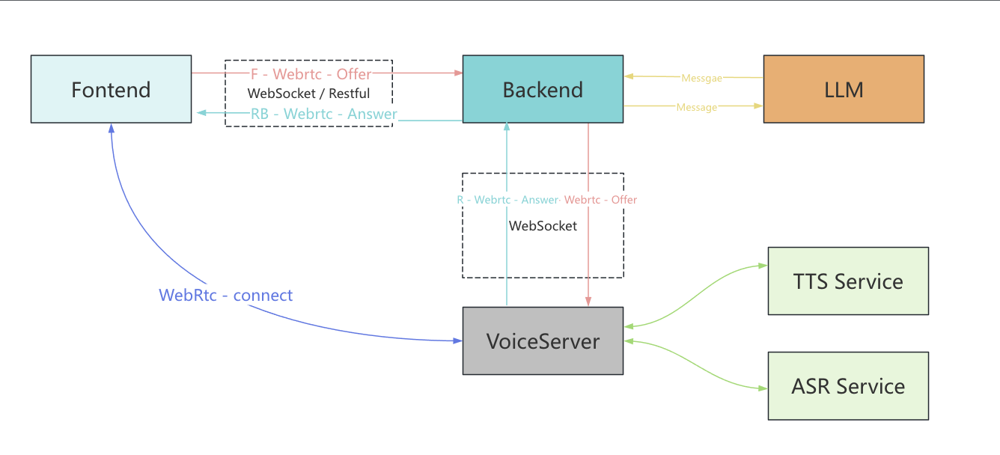
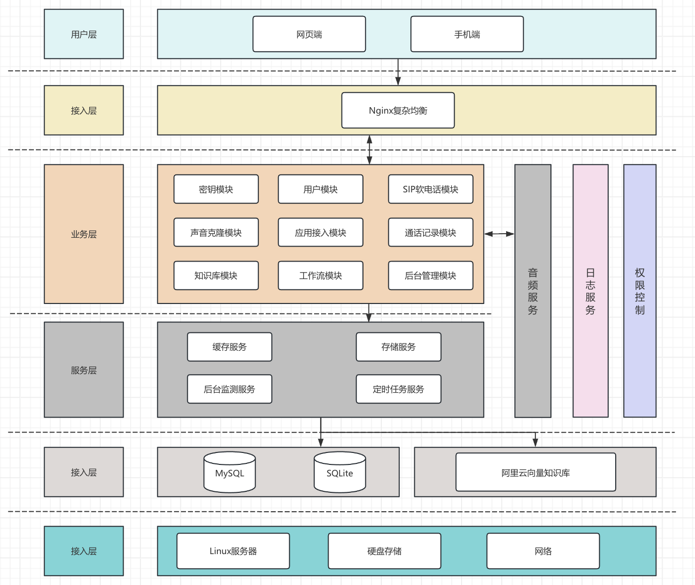
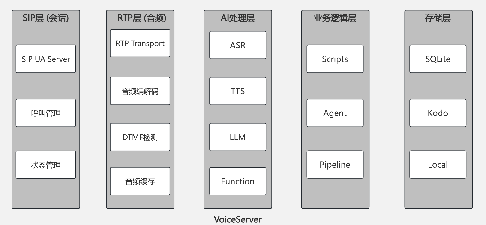
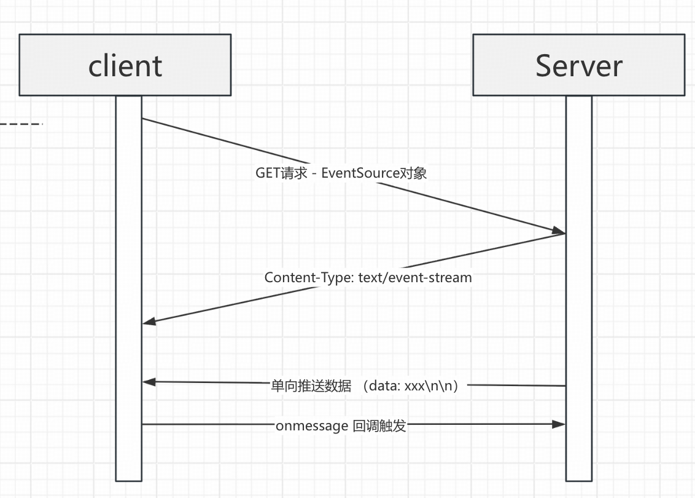

# Architecture Documentation

## 🏗️ Technical Architecture

  

## Core WebRTC Call Flow

  

## Service Architecture

| Service | Port | Tech Stack | Description |
|---------|------|------------|-------------|
| **Main Service** | 7072 | Go + Gin | Core backend service |
| **Voice Service** | 8000 | Go | WebSocket voice service |
| **VAD Service** | 7073 | Python + FastAPI | Voice activity detection service |
| **Voiceprint Service** | 7074 | Python + FastAPI | Voiceprint recognition service |
| **Frontend Service** | 3000 | React + Vite | Development frontend |

## System Architecture Diagram

  

## Voice Server Core

  

## SSE (Server-Sent Events) Flow

  

## 📦 Service Components

### Core Services

- **Main Service** (`cmd/server/`) - Core backend service providing RESTful API and WebSocket support
- **Voice/SIP Service** - Integrated into main server, providing SIP softphone and voice processing capabilities
- **MCP Service** (`cmd/mcp/`) - Model Context Protocol service

### Standalone Services

- **VAD Service** (`services/vad-service/`) - SileroVAD-based voice activity detection service
  - Supports PCM and OPUS formats
  - HTTP RESTful API
  - Real-time voice activity detection
  - Silence detection and session management

- **Voiceprint Recognition Service** (`services/voiceprint-api/`) - ModelScope-based voiceprint recognition service
  - Speaker identification
  - Voiceprint registration and management
  - MySQL database storage
  - RESTful API interface

