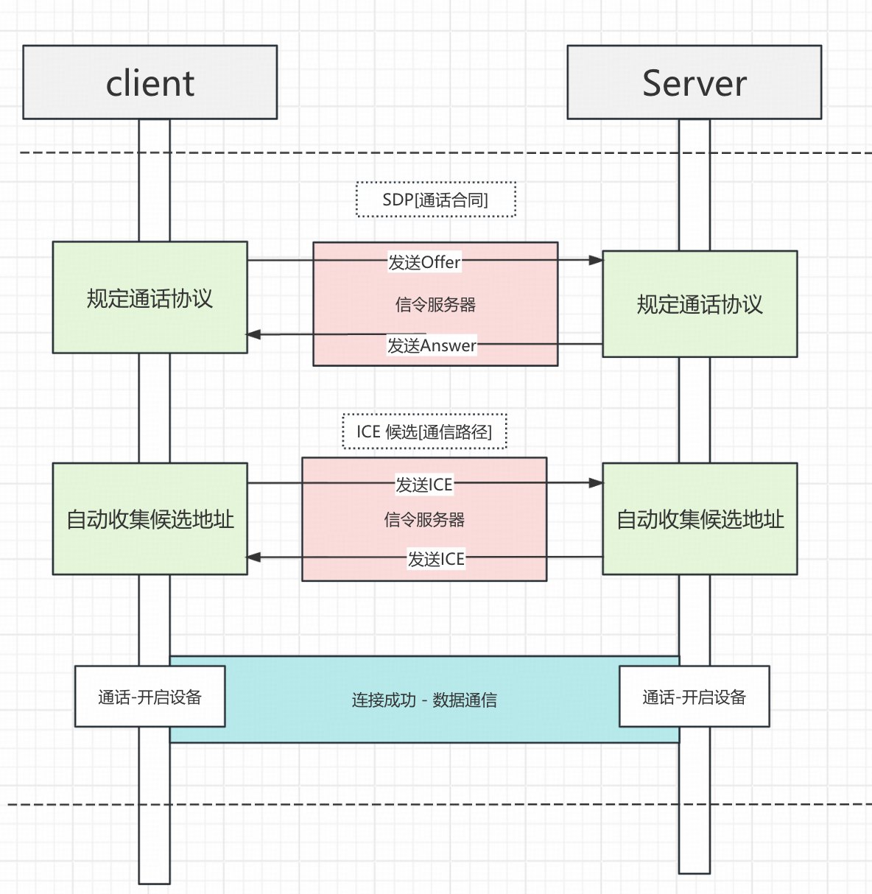
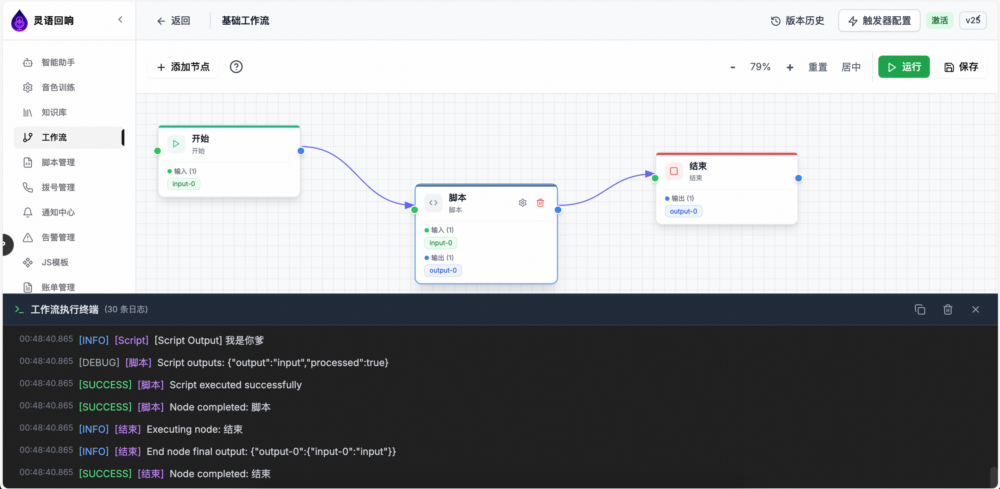
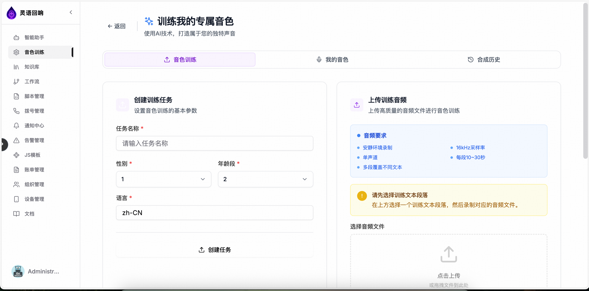
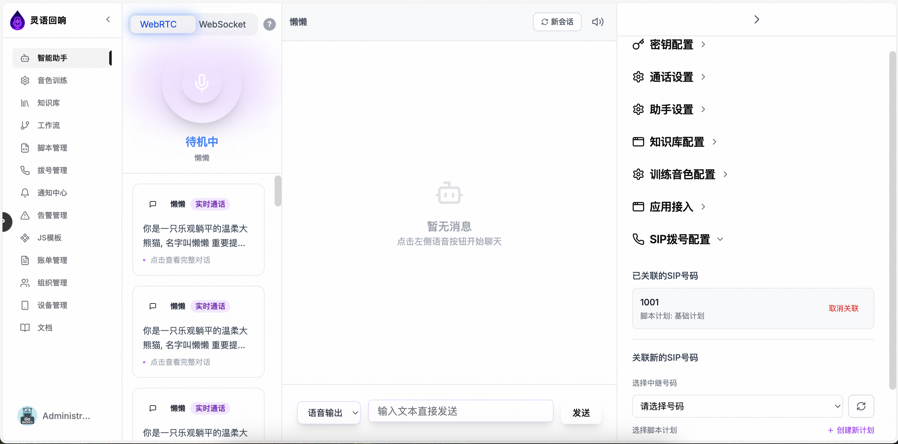
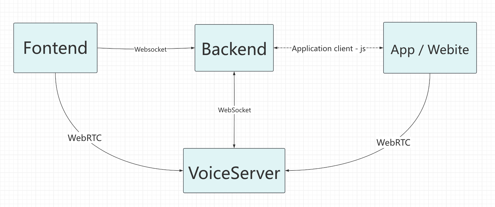
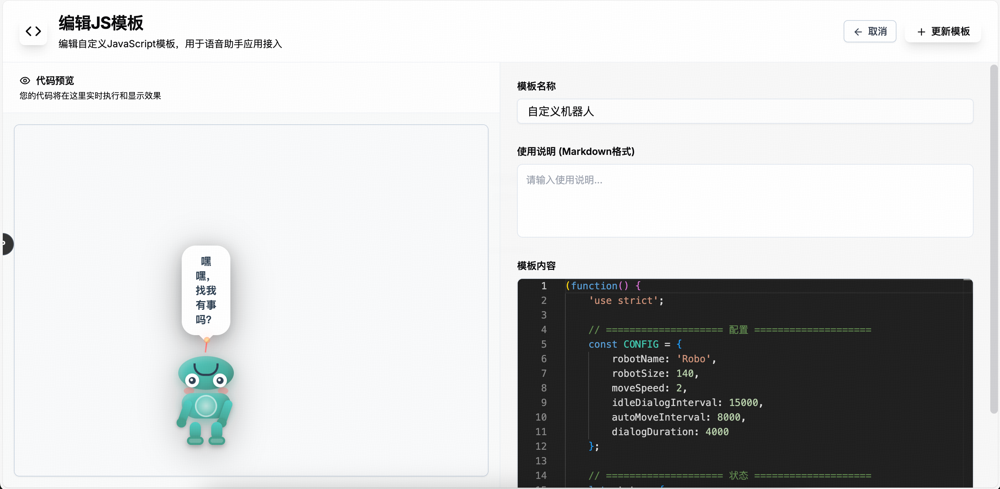
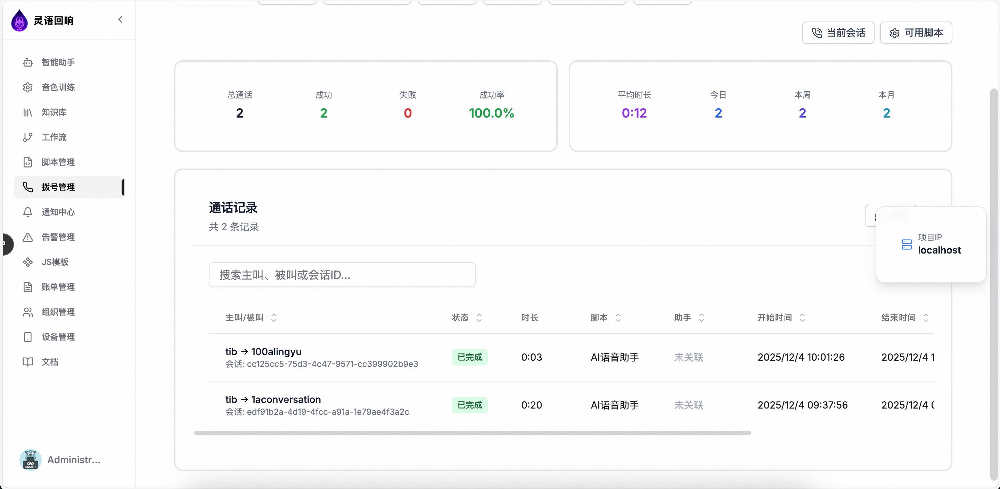
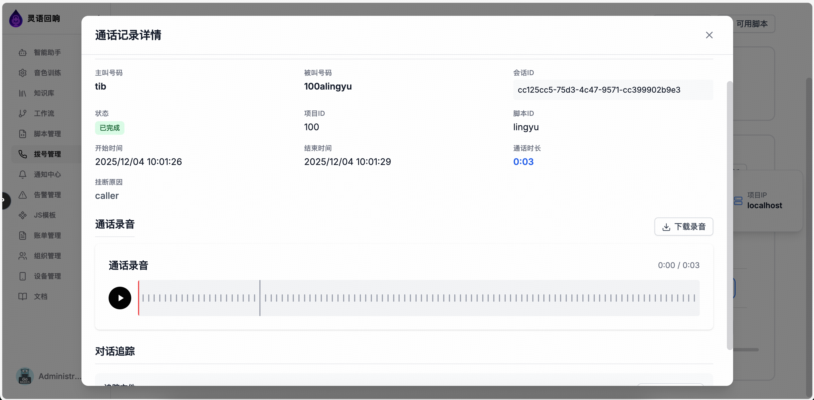

# Features Documentation

## 🎯 Core Features

### 1. 🎤 Real-time Voice Interaction

<div align="center">
  
</div>

- **WebRTC Technology** - Low-latency real-time voice calls
- **Multi-channel Audio Processing** - Support for multiple users calling simultaneously
- **Audio Quality Optimization** - Adaptive bitrate and noise reduction
- **Cross-platform Support** - Support for Web, mobile, and desktop

### 2. 🔄 Visual Workflow Automation

<div align="center">
  
</div>

- **Drag-and-drop Designer** - Intuitive node connection interface
- **Multiple Node Types** - Start, End, Script, Task, Condition, and more
- **Real-time Execution Monitoring** - Visual execution progress and status with WebSocket streaming
- **Node Testing** - Test individual nodes with custom inputs
- **Multiple Trigger Types**:
  - **API Trigger** - Public or authenticated API endpoints for external systems
  - **Event Trigger** - Listen to system events and trigger workflows automatically
  - **Schedule Trigger** - Cron-based scheduled execution
  - **Webhook Trigger** - Receive webhooks from external services
  - **Assistant Trigger** - Allow AI assistants to call workflows as tools
- **Error Handling Mechanism** - Automatic retry and exception recovery
- **Parameter Management** - Define input/output parameters for each node

**Workflow API Example**:
```bash
# Trigger workflow via public API
curl -X POST http://localhost:7072/api/public/workflows/my-workflow/execute \
  -H "Content-Type: application/json" \
  -H "X-API-Key: your-api-key" \
  -d '{
    "parameters": {
      "userName": "John",
      "orderId": "12345",
      "amount": 99.99
    }
  }'
```

### 3. 🎨 Voice Cloning Technology

<div align="center">
  
</div>

- **Voice Training** - Support for custom voice model training
- **Multi-voice Support** - Male, female, child voices, and more
- **Audio Quality Optimization** - High-fidelity audio synthesis
- **Personalized Customization** - Exclusive AI assistant voice characteristics
- **Training Task Management** - Track training progress and manage voice models

### 4. 🤖 Intelligent Conversation Engine

<div align="center">
  
</div>

- **Multi-model Support** - GPT, Claude, DeepSeek, and other mainstream models
- **Context Understanding** - Long conversation memory and context correlation
- **Knowledge Base Integration** - Enterprise knowledge base intelligent Q&A
- **Workflow Integration** - AI assistants can call workflows as tools

### 5. 🔧 Application Integration

<div align="center">
  
</div>

<div align="center">
  
</div>

- **JS Injection Method** - Quick integration of new applications for seamless integration
- **API Gateway** - Unified API management and access control
- **Key Management** - Enterprise-level key management system with custom key configuration
- **Billing System** - Flexible billing strategies and monitoring
- **Credential Management** - Secure storage and management of API credentials

### 6. 📞 SIP Softphone System

<div align="center">
  
</div>

<div align="center">
  
</div>

- **SIP Protocol Support** - Standard SIP protocol implementation
- **Softphone Functionality** - Enterprise-level softphone solution
- **Call Records** - Complete call history management with detailed view
- **High-performance Voice Processing** - Real-time audio encoding/decoding and processing
- **ACD (Automatic Call Distribution)** - Intelligent call routing and agent management
- **Audio Playback** - Play call recordings with waveform visualization
- **Trace File Download** - Download conversation trace files for analysis

### 7. 🔌 Device Management

- **Device Registration** - Register and manage IoT devices
- **OTA Firmware Updates** - Over-the-air firmware update system
- **Device Monitoring** - Real-time device status and health monitoring
- **Remote Control** - Control devices remotely through the platform
- **Device Groups** - Organize devices into groups for batch operations

### 8. 🚨 Alert System

- **Rule-based Monitoring** - Define custom alert rules based on metrics and conditions
- **Multi-channel Notifications** - Email, internal notifications, webhooks, and SMS (reserved)
- **Alert Severity Levels** - Critical, High, Medium, Low severity classification
- **Alert Management** - Track, resolve, and mute alerts
- **Alert History** - Complete audit trail of all alerts

### 9. 💰 Billing System

- **Usage Tracking** - Detailed usage records for all services
- **Bill Generation** - Automatic and manual bill generation
- **Quota Management** - User and group quota management
- **Usage Analytics** - Comprehensive usage statistics and reports
- **Cost Allocation** - Track costs by user, group, or service

### 10. 👥 Organization Management

- **Multi-tenant Support** - Support for multiple organizations
- **Group Management** - Create and manage groups within organizations
- **Member Management** - Invite, manage, and remove members
- **Resource Sharing** - Share knowledge bases, workflows, and resources within groups
- **Permission Control** - Fine-grained permission management

### 11. 📚 Knowledge Base Management

- **Document Storage** - Store and manage documents in knowledge bases
- **Intelligent Retrieval** - AI-powered document search and retrieval
- **Multi-provider Support** - Support for multiple knowledge base providers (e.g., Alibaba Cloud Bailian)
- **Version Control** - Track document versions and changes
- **Organization Sharing** - Share knowledge bases within organizations

### 12. 🔊 VAD Voice Activity Detection Service

- **Standalone Service** - Independent HTTP service based on SileroVAD (port 7073)
- **Multi-format Support** - Supports PCM and OPUS audio format input
- **Real-time Detection** - Provides `have_voice` and `voice_stop` status detection
- **Session Management** - Supports multi-session state management
- **Dual Threshold Mechanism** - High/low threshold detection with sliding window smoothing

**Quick Start**:
```bash
cd services/vad-service
python3 -m venv venv
source venv/bin/activate
pip install -r requirements.txt
python vad_service.py
```

### 13. 🎙️ Voiceprint Recognition Service

- **ModelScope Integration** - ModelScope-based voiceprint recognition model
- **Speaker Identification** - Supports multi-speaker identification and similarity calculation
- **Voiceprint Registration** - Supports voiceprint feature extraction and database storage
- **RESTful API** - Complete HTTP API interface (port 7074)

**Quick Start**:
```bash
cd services/voiceprint-api
python3.10 -m venv venv  # Python 3.10 recommended
source venv/bin/activate
pip install --upgrade pip setuptools wheel
pip install torch torchaudio --index-url https://download.pytorch.org/whl/cpu
pip install -r requirements.txt
python -m app.main
```

### 14. 🔌 Hardware Device Support

- **xiaozhi Protocol** - Complete xiaozhi WebSocket protocol support
- **Real-time Audio Processing** - Supports OPUS and PCM audio formats
- **Multiple ASR/TTS Providers** - Supports Tencent, Qiniu, FunASR, Google, Volcengine, Gladia, etc.
- **LLM Integration** - Supports multiple large language model integrations
- **State Management** - Complete client state and session management

